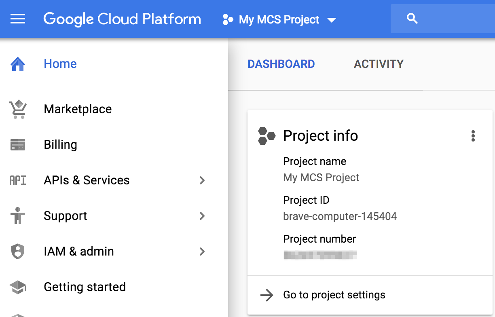
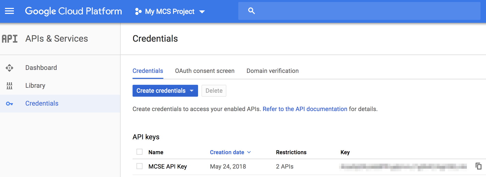

# 設定 GCM 手機推播功能

MCSE 可讓使用者設定多種觸發的通知方式，其中手機推播是透過 **Google Cloud Messaging (GCM)** 發送訊息到用戶的手機端。因此，在正式使用此功能之前，您必須先至 Google Cloud Platform 申請一組能使用 GCM 的 API 金鑰，並將此資訊填入 MCSE 的設定檔中。

Google API 金鑰的申請方法如下：

1. 先在 **Google Cloud Platform** [https://console.cloud.google.com/Google](https://console.cloud.google.com/Google) 建立一個專案。此專案的**專案編號 (Project number)** 即是所謂的 **GCM\_SENDER\_ID**，稍後會需要在 MCSE 設定檔中輸入此資訊。

	

2. 並在此專案的 **APIs 和服務** 中建立一個 Google Cloud Messaging API 的使用憑證並取得金鑰。這串金鑰即是所謂的 **GCM\_API\_KEY**，稍後會需要在 MCSE 設定檔中輸入此資訊。

	

MCSE 設定檔的修改方式如下：

1. 在 MCSE 的安裝檔案目錄下，編輯 **.env** 檔案中的以下兩個環境參數

	* GCM\_SENDER\_ID：您在 Google Cloud Platform 所建立的**專案編號 (Project number)**
	* GCM\_API\_KEY：您在此專案下建立的 **API 憑證與金鑰**
	
	```
	GCM_SENDER_ID=77010643xxxx
	GCM_API_KEY=AIzaSyBvLsbFV25Ha5lV1PSQ2uMcZrxxxx
   ```
2. 修改完成後，儲存 .env 檔案，並重新啟動 MCSE 服務，使新的設定生效。或是接續完成其他進階設定後，再一起重啟服務。

	```
	$ docker-compose stop
	$ docker-compose up -d
	```