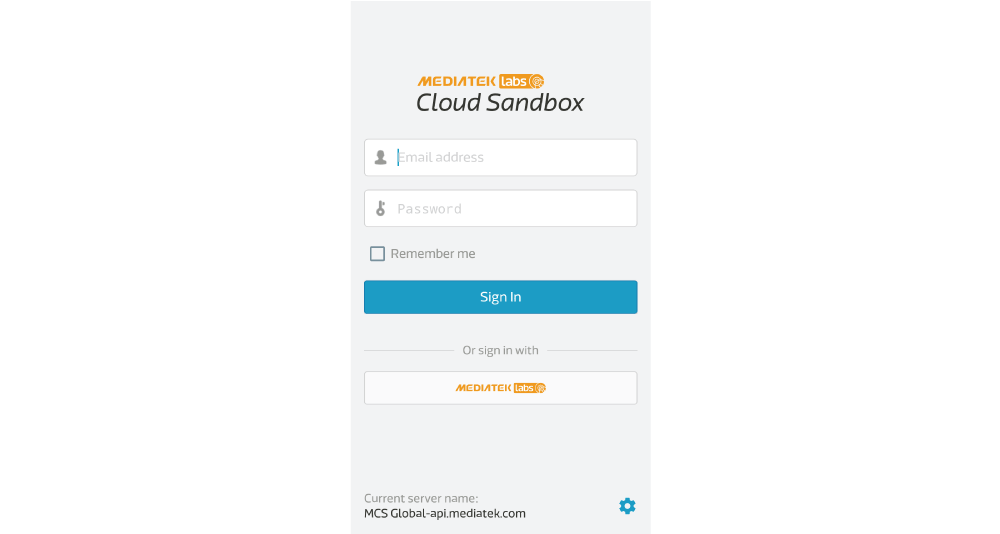
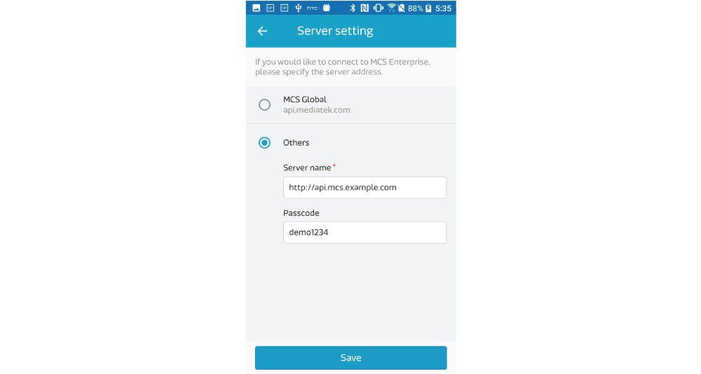

# 使用 MCSE Mobile App

您可以直接使用在 Google Play 下載的 **MediaTek Cloud Sandbox** 手機應用程式，透過內建的**切換服務器**功能，連線到您所架設的 MCSE 服務。

1. 至 [Google Play](https://play.google.com/store/apps/details?id=com.mediatek.iotcloud) 下載 MCS 手機應用程式。

2. 在 應用程式登入畫面下方，可看到連線服務器的設定。

	
	
3. 點擊設定圖標，進入 **Server Setting** 頁面。在當中，有兩個必填欄位：

	* MCSE 服務器網址 (Server Name)：MCSE API 服務器的網址。
	* 密碼 (Passcode)：獲取設定檔的密碼，預設為 demo1234。若您之後想要更改密碼，可修改 docker-compose.yml 檔案 -> mcs 服務 -> MCS\_SERVER\_PASSCODE 參數。

	

	
4. 設定完成後，按下 **Save** 按鈕，回到登入頁面，使用您在 MCSE 註冊的帳號登入即可。