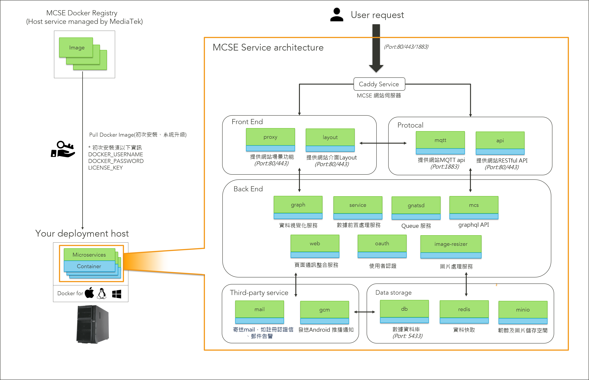

# MCSE 服務架構

## 系統架構圖

MCSE 整體系統，是透過數個部署於容器 \(Container\)的微服務 \(Microservices\) 所組成，各司其職。以下是各服務間的架構關係圖。

## 服務解說

各服務名稱也可在 **docker-compose.yml** 裏找到對應的服務與詳細設定。

| 服務名稱 | 用途 | 類別 |
| :--- | :--- | :--- |
| db | 後端資料庫 | 後端 |
| redis | 資料快取 | 後端 |
| image-resizer | 縮圖服務\(用於 device, prototype 及 scene 圖片\) | 後端 |
| gnatsd | Queue 服務，使用 nats.io 開源專案 | 後端 |
| minio | 儲存空間服務，使用 minio.io 開源專案 | 後端 |
| oauth | 使用者認證 | 後端 |
| mqtt | mqtt 服務 | 後端 |
| gcm | 發送 android notification | 後端 |
| mail | 發送 email service | 後端 |
| service | 上傳 datapoint 後，會將觸發資料丟到 queue service | 後端 |
| api | 提供 mcs 網站 restful api service | 後端 |
| mcs | 提供 mcs 網站 grephql api service | 後端 |
| proxy | mcs 網站 scene frontend service | 前端 |
| layout | mcs 整個網站前端畫面 | 前端 |
| web | 整合 restful + graphql + websocket 服務 | 後端 |
| video | 提供影像串流服務 | 後端 |

