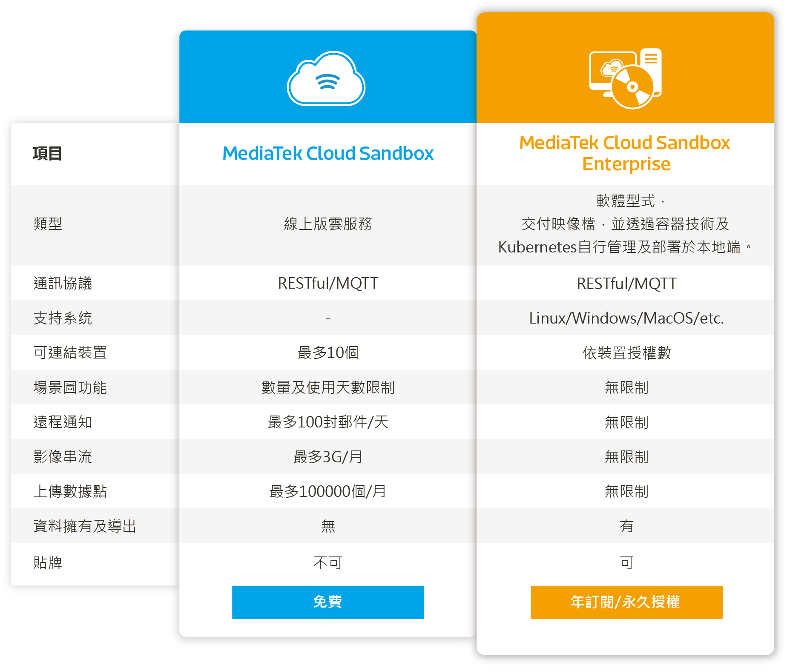

# 用途及應用場景

**MediaTek Cloud Sandbox Enterprise**（以下簡稱 **MCSE**）為基於免費的 [MediaTek Cloud Sandbox](https://mcs.mediatek.com) 雲服務（以下簡稱 MCS）延伸出來的企業版本，提供企業用戶從產品開發到物聯網應用落地的一站式使用體驗。

若您是以下類型的 MCS 使用者，MCSE 將會是最適合您的**物聯網私有雲管理平台**：

* 已在 MCS 上驗證完您所開發的產品並需要大量資料點，但缺乏足夠的人力及時間自行在伺服器或公有雲上開發物聯網平台
* 裝置所蒐集到的資料具有私密性，有意掌握完整的數據以利後續應用
* 非常熟悉 MCS 的企業使用者，有意從裝置管理到監控介面全部使用 MCSE 後台進行快速開發

以下是線上版 MCS 雲服務及 MCSE 的簡易比較表：

我們將 MCS 上所有的功能，以 Docker 容器技術封裝成一個軟體型式的鏡像檔 \(以下簡稱Docker Image\)，並將此軟體授權給您使用。

您可以透過簡單的 Linux 指令，一鍵將整個 MCSE 安裝在您屬意的公有雲 \(如AWS、Azure、GCP等\)，面對您所處行業的客戶；或是將 MCSE 部署在本地端的伺服器上 \(如 IBM 或 HP server\)，供您的物聯網裝置或提供給需要私有雲的客戶。

MCSE 也會提供有別於 MCS 的企業專屬功能，您可以透過 Docker 的鏡像檔管理倉庫 \(以下簡稱 Docker Registry\)，隨時獲得 MCSE 的更新。

此外，您還可以將裝置資料，透過 MCSE 的資料接口導入熟悉的資料庫，進行數據的管理、分析及商業決策。

下面的章節，我們將一步步引導您完成 MCSE 的安裝。

