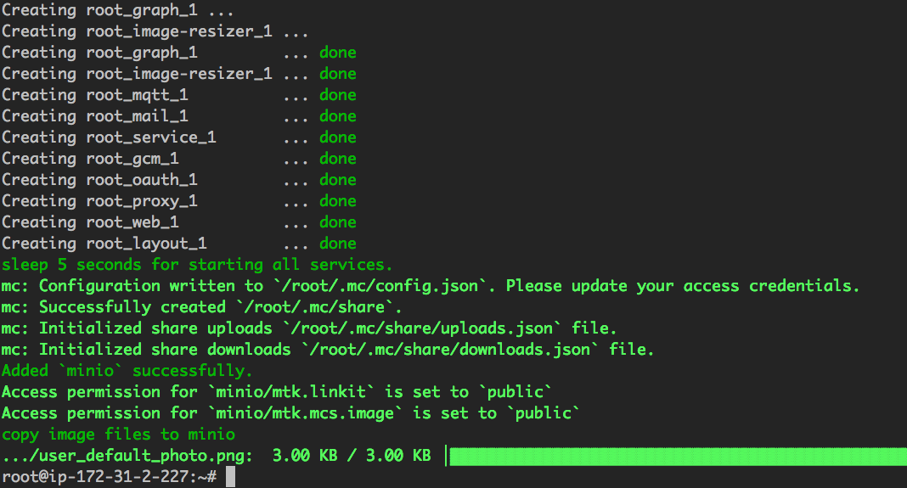

# 執行安裝腳本

## 下載與解壓縮

首先，請您先下載 MCSE 安裝檔（若要取得檔案，請洽 MCSE 業務窗口 _mediatekcloudsandbox@mediatek.com_），將檔案置於您預安裝 MCSE 的 Ubuntu 的機器上並且解壓縮。

執行範例：

1. 下載 MCSE 安裝檔

   ```text
    $ wget https://s3-us-west-2.amazonaws.com/xxxxx/release.tar.gz
   ```

2. 將安裝檔解壓縮，並透過 `ls` 檢查檔案是否正確

   ```text
    $ tar -xvf release.tar.gz 
    $ ls -al
    total 204
    drwxrwxr-x  4 ubuntu ubuntu   4096 Sep  7 08:19 .
    drwxr-xr-x 11 ubuntu ubuntu   4096 Sep  7 08:15 ..
    -rw-r--r--  1 ubuntu ubuntu    835 Aug 27 07:00 Caddyfile
    -rw-r--r--  1 ubuntu ubuntu   9431 Aug 27 07:00 docker-compose.yml
    -rw-r--r--  1 ubuntu ubuntu    488 Aug 27 07:00 .env
    drwxr-xr-x  2 ubuntu ubuntu   4096 Aug  2 07:13 images
    -rwxr-xr-x  1 ubuntu ubuntu   3420 Aug 29 09:25 install.sh
    -rw-rw-r--  1 ubuntu ubuntu 158624 Aug 29 09:27 release.tar.gz
    drwxr-xr-x  2 ubuntu ubuntu   4096 Aug  6 01:20 sql
    -rwxr-xr-x  1 ubuntu ubuntu    645 Aug 27 07:00 uninstall.sh
   ```

## 腳本與參數

為了簡化安裝流程，MCSE 提供了一套安裝腳本 `install.sh`，您可以直接執行這套腳本進行安裝。

```text
$ ./install.sh HOST DOCKER_USERNAME DOCKER_PASSWORD DB_PASSWORD LICENSE_KEY
```

以下為運行此腳本和完成 MCSE 設定必要的參數：

| 參數 | 描述 |
| :--- | :--- |
| HOST | 您的 MCSE Domain 名稱 \(例如 mcs.example.com\) |
| DOCKER\_USERNAME | Docker Registry 登入帳號 \(請輸入由 Mediatek 所提供的帳號\) |
| DOCKER\_PASSWORD | Docker Registry 登入密碼 \(請輸入由 Mediatek 所提供的密碼\) |
| DB\_PASSWORD | 資料庫密碼 \(請自行設定，此為您往後連線 MCSE 資料庫的密碼\) |
| LICENSE\_KEY | 軟體授權金鑰 \(請輸入由 Mediatek 所提供的金鑰\) |

執行範例：

```text
$ ./install.sh mcs.example.com \
  docker_user \
  docker1234 \
  db1234 \
  Yt369FVnGL9TDxxxx_dLfCUlZxg==
```

執行成功結果：



## 系統參數

MCSE 已經將幾個常修改的參數設定在 `.env` 檔案當中，您可在安裝前先變更這些設定，也可在安裝後再行調整，更多設定詳情請見進階設定。

| 參數 | 描述 | 預設值 | 備註 |
| :--- | :--- | :--- | :--- |
| MCS\_DOMAIN\_NAME | 您的 MCSE Domain 名稱 | mcs.example.com | 第一次安裝時，不需修改（請見下方注意事項） |
| MCS\_LICENSE\_KEY | 軟體授權金鑰 | default\_license\_key | 第一次安裝時，不需修改（請見下方注意事項） |
| DB\_DATABASE | 資料庫名稱 | mcs |  |
| DB\_SCHEMA | 資料庫 SCHEMA | mcs |  |
| DB\_USERNAME | 資料庫使用者 | mediatek |  |
| DB\_PASSWORD | 資料庫密碼 | default\_password | 第一次安裝時，不需修改（請見下方注意事項） |
| DB\_HOST | 資料庫主機名稱 | db |  |
| DB\_PORT | 資料庫連接埠 | 5432 |  |
| GCM\_SENDER\_ID | GCM Sender ID |  | Google 已於 2018 年 4 月終止新的 GCM 服務申請，若您之前不曾申請過此服務，可使用 MCSE 預設提供的 ID 不需更換 |
| GCM\_API\_KEY | GCM API Key |  | 同上 |
| SMTP\_USER | SMTP 使用者名稱 | cettoana@gmail.com | 詳情可見 [進階設定- SMTP](../advanced/advanced_smtp.md) |
| SMTP\_PASSWORD | SMTP 使用者密碼 | RnKA5TUcm8Yo | 同上 |
| SMTP\_HOST | SMTP 服務器網址 | mail.smtp2go.com | 同上 |
| SMTP\_PORT | SMTP 服務連接埠 | 465 | 同上 |
| SMTP\_SSL | SMTP 連線協定 | true | true, false |
| PROTOCOL | MCSE 服務連線協定 | http | http, https（稍後章節會介紹如何設定 HTTPS 網頁服務器） |
| S3\_SSL | 啟動 S3 SSL | false | true, false |

### 注意事項 

這些參數會在執行 install.sh 時帶入（請見表格一），因此無需事前修改 `.env` 檔案；若您事先修改了 `.env`這些參數，再次執行 install.sh 時，帶入的參數則無法作用。

