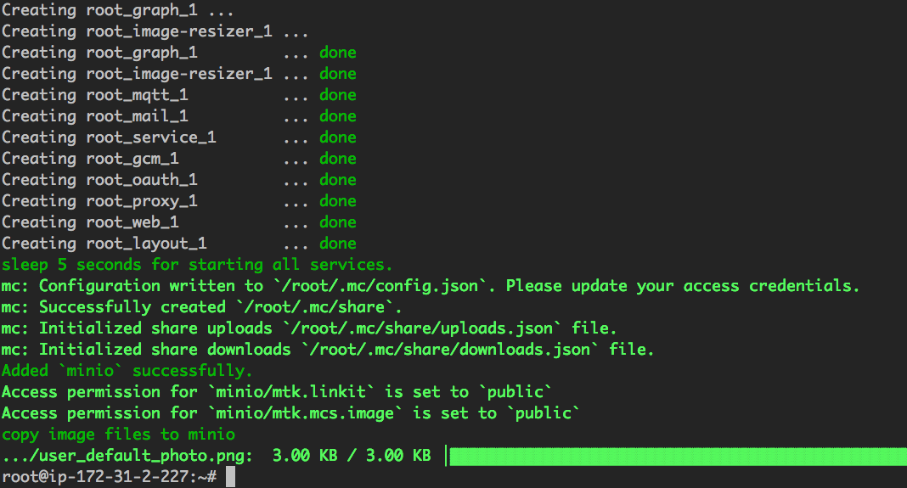

# 執行安裝腳本

## 腳本與參數

為了簡化安裝流程，MCSE 提供了一套安裝腳本，您可以直接執行這套腳本進行安裝。

```
$ ./install.sh HOST DOCKER_USERNAME DOCKER_PASSWORD DB_PASSWORD LICENSE_KEY
```

以下為運行此腳本和完成 MCSE 設定必要的參數：

| 參數                 | 描述                                       |
|:---|:---|
| HOST                | 您的 MCSE Domain 名稱 (例如 mcs.example.com) |
| DOCKER_USERNAME     | Docker Registry 登入帳號 (請輸入由 Mediatek 所提供的帳號) |
| DOCKER_PASSWORD     | Docker Registry 登入密碼 (請輸入由 Mediatek 所提供的密碼) |
| DB_PASSWORD         | 資料庫密碼 (請自行設定，此為您往後連線 MCSE 資料庫的密碼) |
| LICENSE_KEY         | 軟體授權金鑰 (請輸入由 Mediatek 所提供的金鑰) |


執行範例：

```
root@mcse-ubuntu:/home/ubuntu/mcse# ./install.sh mcs.example.com docker_user docker1234 db1234 Yt369FVnGL9TDxxxx_dLfCUlZxg==
```

執行成功結果：


## 系統參數


MCSE 已經將幾個常修改的參數設定在 `.env` 檔案當中，您可在安裝前先變更這些設定也可在安裝後再行調整，更多設定詳情請見進階設定。


| 參數 | 描述 | 預設值 | 備註 |
|:---|:---|:---|:---|
| MCS\_DOMAIN\_NAME | 您的 MCSE Domain 名稱 | mcs.example.com  | 第一次安裝時，不需修改（請見下方注意事項） |
| MCS\_LICENSE\_KEY | 軟體授權金鑰 | default_license_key | 第一次安裝時，不需修改（請見下方注意事項） |
| DB\_DATABASE     | 資料庫名稱 | mcs | |
| DB\_SCHEMA       | 資料庫 SCHEMA | mcs | |
| DB\_USERNAME     | 資料庫使用者 | mediatek | |
| DB\_PASSWORD     | 資料庫密碼 | default_password | 第一次安裝時，不需修改（請見下方注意事項） |
| DB\_HOST         | 資料庫主機名稱  | db | |
| DB\_PORT         | 資料庫連接埠 | 5432 | |
| GCM\_SENDER\_ID   | GCM Sender ID |  | Google 已於 2018 年 4 月終止新的 GCM 服務申請，若您之前不曾申請過此服務，可使用 MCSE 預設提供的 ID 不需更換|
| GCM\_API\_KEY     | GCM API Key |  | 同上 |
| SMTP\_USER       | SMTP 使用者名稱 | cettoana@gmail.com | 詳情可見 [進階設定- SMTP](./advanced_smtp.md) |
| SMTP\_PASSWORD   | SMTP 使用者密碼 | RnKA5TUcm8Yo | 同上 |
| SMTP\_HOST       | SMTP 服務器網址 | mail.smtp2go.com | 同上 |
| SMTP\_PORT       | SMTP 服務連接埠 | 465 | 同上 |
| SMTP\_SSL        | SMTP 連線協定   | true | true, false |
| PROTOCOL        | MCSE 服務連線協定  | http | http, https（稍後章節會介紹如何設定 HTTPS 網頁服務器） |
| S3\_SSL          | 啟動 S3 SSL | false| true, false |


**注意事項**：這些參數會在執行 install.sh 時帶入（請見表格一），因此無需事前修改 `.env` 檔案，若您已修改 `.env`，再次執行 install.sh 時，帶入的參數則無法作用。
