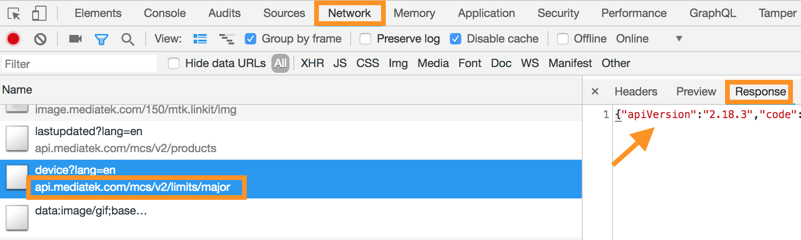

# 疑難排除

## 1. 啟動 MCSE 服務後，透過瀏覽器訪問會看到**連線失敗**或是 **This site can’t be reached** 的錯誤訊息。

請檢查您的 **Caddy 伺服器** 與 MCSE 服務的 **Docker 容器 \(Container\)**是否正常運行。

* Caddy: 透過 `ps` 指令看 caddy 是否在運行中。若 `caddy -conf Caddyfile` 不存在，則切換至 MCSE 安裝檔案目錄，執行 Caddy 服務。

  執行範例：

  * Caddy 正常運行中 

  ```text
    root@mcse-ubuntu:/home/ubuntu/mcse# ps -aux|grep caddy
    ubuntu   13915  0.0  0.3  18816 12788 pts/0    Sl   05:40   0:00 caddy -conf Caddyfile
    ubuntu   19592  0.0  0.0  12944  1088 pts/0    S+   05:44   0:00 grep --color=auto caddy
  ```

  * Caddy 服務不存在

  ```text
    root@mcse-ubuntu:/home/ubuntu/mcse# ps -aux|grep caddy
    ubuntu   19592  0.0  0.0  12944  1088 pts/0    S+   05:44   0:00 grep --color=auto caddy
    root@mcse-ubuntu:/home/ubuntu/mcse# caddy -conf Caddyfile &
  ```

* Docker 容器 \(Container\): 透過 `docker-compose ps` 指令看每個服務是否在運行中，`STATUS = Up` 或 `STATUS = Up (healthy)`。

  如果無法正常運作，請嘗試停止並重啟此單一服務，或整個 MCSE（請參考[系統管理](troubleshooting.md)章節）

  執行範例：

  ```text
    root@mcse-ubuntu:/home/ubuntu/mcse# docker-compose ps
            Name                      Command                   State                            Ports                     
    -----------------------------------------------------------------------------------------------------------------------
    mcse_api_1             sh scripts/docker.sh             Up               0.0.0.0:3000->3000/tcp                        
    mcse_db_1              docker-entrypoint.sh postgres    Up               0.0.0.0:5433->5432/tcp                        
    mcse_gcm_1             node build/index.js              Up (healthy)     8080/tcp                                      
    mcse_gnatsd_1          /gnatsd -c gnatsd.conf           Up               0.0.0.0:4222->4222/tcp, 6222/tcp, 8222/tcp    
    mcse_graph_1           /bin/sh -c node_modules/.b ...   Up               0.0.0.0:3003->3003/tcp                        
    mcse_image-resizer_1   /bin/run.sh                      Up               0.0.0.0:8002->80/tcp                          
    mcse_layout_1          sh docker/run.sh                 Up               0.0.0.0:3001->80/tcp                          
    mcse_mail_1            node build/app.js                Up (healthy)     8080/tcp                                      
    mcse_mcs_1             /go-mcs server                   Up (healthy)     0.0.0.0:8089->8080/tcp                        
    mcse_minio_1           /usr/bin/docker-entrypoint ...   Up (healthy)   0.0.0.0:9000->9000/tcp                        
    mcse_mqtt_1            sh scripts/run.sh                Up               0.0.0.0:1883->1883/tcp, 0.0.0.0:3011->3011/tcp
    mcse_oauth_1           sh scripts/docker.sh             Up               0.0.0.0:3002->3002/tcp                        
    mcse_proxy_1           /bin/sh -c ./proxy               Up (healthy)     0.0.0.0:4000->4000/tcp                        
    mcse_redis_1           docker-entrypoint.sh redis ...   Up               0.0.0.0:6378->6379/tcp                        
    mcse_service_1         node build/app.js                Up (healthy)     8080/tcp                                      
    mcse_web_1             /bin/sh -c ./web                 Up (healthy)     0.0.0.0:4001->4000/tcp
  ```

## 2. 開啟 MCSE 網頁，登入後頁面只能看到 Header 與 Footer 但中間內容為空白。

登入 MCSE 之後，主要頁面是由 **api** 服務來處理，因此當頁面空白時請透過以下幾個步驟來查找問題。

1. 透過 `docker-compose ps` 來查看各個服務是否正常運行。若有任何服務出現錯誤，請重新啟動。若問題仍然發生或是您想針對問題作進一步的研究，請參考下面步驟。
2. 使用瀏覽器的 **開發人員工具**，切換至 **網路面板**，此時刷新 MCSE 頁面，觀察開發人員工具中的網頁請求看是否有出現錯誤（紅色）的請求紀錄，api 服務的網域名稱為 **api.mcs.example.com** 其中 example.com 請自行轉換成您的網域。找到錯誤的 api 請求後，請選取此請求並且切換至此請求的 **回應** 頁面，並記錄下服務器所回傳的錯誤訊息。

   

   詳細用法可參考 [Chrome 的網路面板教學](https://developers.google.com/web/tools/chrome-devtools/network-performance/resource-loading?hl=zh-tw)

3. 透過 `docker-compose logs -f 服務名稱` 來查看各個服務的日誌。若步驟 2 中，有發現 api 服務回應錯誤，則可利用 `docker-compose logs -f api` 收集到個精確的系統日誌。

有了以上的錯誤訊息，您可針對問題進行排解，或將資訊提供給 MCSE 聯絡窗口幫忙處理。

## 3. MCSE 無法正常寄發郵件

若您是使用 MCSE 預設的 SMTP 帳號，由於此帳號是與其他客戶共用發信額度，所以當寄發數量到達**額度上限**時，會導致後續的信件無法被寄出。建議您在正式使用 MCSE 時，請將 SMTP 帳號置換成您自有的帳號。詳細步驟請參考：[設定 SMTP](setup_and_setting/advanced/advanced_smtp.md)

MCSE 會寄發有三種郵件，若只有特定的郵件無法送出，可檢查該服務的日誌或重啟服務。

1. 註冊後的認證信：由 **oauth** 服務負責寄發。透過查看 oauth 服務日誌中 **oauth email service error** 的錯誤訊息，可協助您修正問題，以下為帳號密碼錯誤的範例。

   ```text
    $ docker-compose logs -f oauth
    ...
    oauth_1          | 2018-09-26T02:55:11.967Z oauth email service error:  { Error: authorization.failed (bad response on command 'QWEwMTEwdGVzdHk=': -5.7.8 Username and Password not accepted. Learn more at)
    oauth_1          |     at SMTPError (/app/node_modules/emailjs/smtp/error.js:6:3)
    oauth_1          |    { Error: bad response on command 'QWEwMTEwdGVzdHk=': -5.7.8 Username and Password not 
    oauth_1          |      smtp: '535-5.7.8 Username and Password not accepted. Learn more at\n535 5.7.8  https://support.google.com/mail/?p=BadCredentials h69-v6sm7828662pfh.13 - gsmtp\r\n',
    ...
   ```

2. 滿足觸發條件後的通知信：由 **mail** 服務負責寄發。
3. 分享原型與裝置的通知信：由 **api** 服務負責寄發。

其他部分請參考 [設定 SMTP 注意事項](setup_and_setting/advanced/advanced_smtp.md#notice)

## 4. 重新安裝後，之前的帳號登入後無法正常使用

若您使用的 **uninstall.sh** 腳本移除 MCSE 後，包括資料庫內的使用者註冊資訊皆會被移除。因此再次安裝後，您必須重新註冊帳號。

由於瀏覽器可能會快取之前您登入 MCSE 時的 cookie 與 token（若重新安裝前後的網址一樣），因此建議您在重新安裝 MCSE 後，使用瀏覽器的無痕模式，或是清除瀏覽器的歷史紀錄包括 Cookie 等快取，再重新註冊、驗證並完成登入程序。

